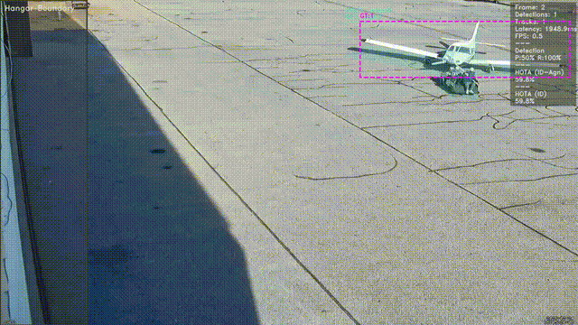
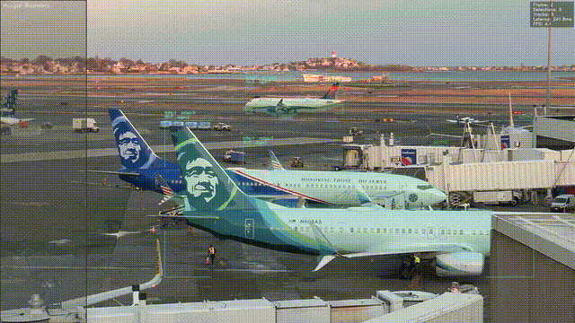

# Plane Tracker

**Approach:** Prioritized extensive visualization to enable manual validation in the absence of robust ground truths.

Aircraft tracking with hangar enter/exit event detection.

### Simple Plane Add


### Boston Airport


## Usage

```bash
# Basic run with visualization
python run.py --video data/simple_plane_add2.mp4

# With ground truth overlay and metrics
python run.py --video data/simple_plane_add2.mp4 --annotations annotations/simple_plane_add2.json

# Save output video
python run.py --video data/simple_plane_add2.mp4 --save-video output.mp4

# Save JSON results with hangar events
python run.py --video data/simple_plane_add2.mp4 --output results.json

# Headless mode
python run.py --video data/simple_plane_add2.mp4 --no-display --output results.json
```

## Configuration

Edit `config.yaml` to adjust:

| Section | Key | Description |
|---------|-----|-------------|
| `detection` | model, confidence | YOLO model path and thresholds |
| `tracker` | iou_threshold, max_age | Tracking parameters |
| `hangar` | cooldown, flash_color | Event detection settings |
| `debug.level` | 0/1/2 | Overlay verbosity |
| `debug.show_ground_truth` | true/false | Show GT boxes + metrics |
| `debug.metrics_iou_threshold` | 0.0-1.0 | IOU threshold for P/R/HOTA |

## Metrics

When `show_ground_truth: true` with annotations loaded:
- **Detection** - Precision/Recall of raw YOLO detections vs GT
- **HOTA (ID-Agn)** - ID-agnostic tracking accuracy
- **HOTA (ID)** - ID-specific tracking accuracy (requires track ID match)

## Output Format

```json
{
  "frames": {
    "123": {
      "tracks": [{"track_id": 1, "bbox": [x1,y1,x2,y2], "class": "aircraft"}],
      "hangar_events": [{"track_id": 1, "event_type": "enter"}]
    }
  }
}
```
